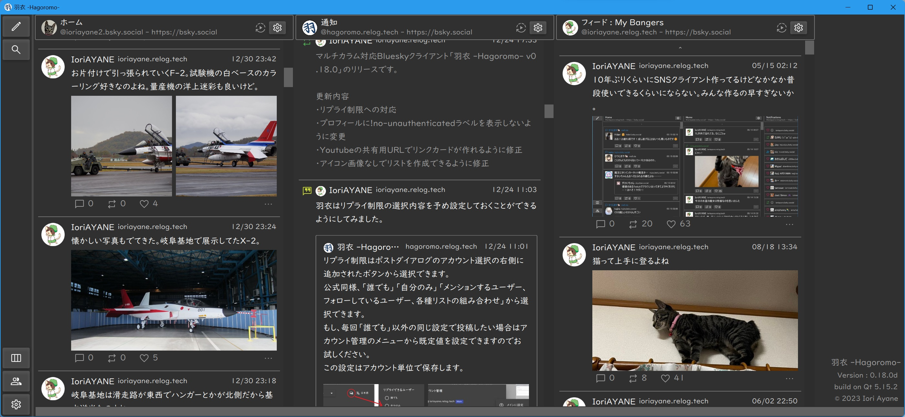

# 羽衣 - Hagoromo -

(English follows Japanese.)

## 概要

マルチカラム対応の[Bluesky](https://blueskyweb.xyz/)クライアントです。



## 動作確認環境

- Windows 11 Profesional
- Ubuntu 22.04
- Mac 15.0.1(x86 on ARM)

## 使用ソフトウェア

- [Qt 6.8.1](https://www.qt.io/)
- [OpenSSL 3.4.0](http://www.openssl.org/)
- [cpp-httplib 0.18.1](https://github.com/yhirose/cpp-httplib)
- [zlib 1.3.1](https://github.com/madler/zlib)
- [Hugo 0.92.2](https://gohugo.io/)

## ダウンロード

ビルド済みの実行ファイルは[Releases](https://github.com/ioriayane/Hagoromo/releases)よりダウンロードしてください。

## インストール

アーカイブを解凍して任意のフォルダに保存してください。

## 使用方法

[ユーザーマニュアル](https://hagoromo.relog.tech/ja/)を参照してください。

## ビルド方法

### 共通

ビルドするプラットフォームのQt 6.8.1をインストールしてください。

Official site : [Qt](https://www.qt.io/)

### Windows

[Microsoft Visual Studio 2022](https://visualstudio.microsoft.com/)をインストールしてください（Community Edition も利用可能です）。

CRLF（Windows のデフォルト）の改行コードでリポジトリを確認してください。

> **注意:** 以下のコマンドはコマンドプロンプト（`cmd`）用です。PowerShell を使用する場合は、コメントの `REM` を `#` に置き換えてください。

```cmd
REM checkout repo
>git clone git@github.com:ioriayane/Hagoromo.git
>cd Hagoromo
>git submodule update -i
REM copy and edit encryption seed
>copy lib\tools\encryption_seed_template.h lib\tools\encryption_seed.h
REM build Hagoromo
>.\scripts\build.bat path\to\Qt\6.8.1\msvc2022_64\
REM Execute
>deploy-hagoromo\hagoromo\Hagoromo.exe
```

### Ubuntu

build.shでビルドします。

```bash
# checkout repo
$ git clone git@github.com:ioriayane/Hagoromo.git
$ cd Hagoromo
$ git submodule update -i
# setup dependent modules
$ sudo apt-get install zlib1g-dev ninja-build
# copy and edit encryption seed
$ cp lib/tools/encryption_seed_template.h lib/tools/encryption_seed.h
$ vi lib/tools/encryption_seed.h
# build Hagoromo
$ ./scripts/build.sh linux path/to/Qt/6.8.1/gcc_64/
# exec hagoromo
$ ./deploy-hagoromo/hagoromo/Hagoromo.sh
```

### Mac

build.shでビルドします。

```bash
# checkout repo
$ git clone git@github.com:ioriayane/Hagoromo.git
$ cd Hagoromo
$ git submodule update -i
# copy and edit encryption seed
$ cp lib/tools/encryption_seed_template.h lib/tools/encryption_seed.h
$ vi lib/tools/encryption_seed.h
# build Hagoromo
$ ./scripts/build.sh mac path/to/Qt/6.8.1/gcc_64/
# exec hagoromo
$ open ./deploy-hagoromo/hagoromo/Hagoromo.app
```

## コントリビューション

変更を加えるときは`dev`からブランチして、`dev`にプルリクエストを提出してください。

また、下記の事項を実施してください。Github Actionsにてチェックしています。

### ソースコードの整形

[pre-commit](https://pre-commit.com/)を使用しています。

git hookで実行されるように公式サイトを確認してセットアップしてください。

セットアップ例
```bash
$ pip install pre-commit
$ pre-commit --version
pre-commit 3.7.1
$ cd path/to/this_repo
$ pre-commit install
pre-commit installed at .git/hooks/pre-commit
```

### 単体テスト

いづれかの環境で実行してクリアできることを確認してください。

Windows
```cmd
> .\scripts\unittest.bat path\to\Qt\6.8.1\msvc2022_64\
```
Ubuntu
```bash
$ ./scripts/unittest.sh linux path/to/Qt/6.8.1/gcc_64/
```
Mac
```bash
$ ./scripts/unittest.sh mac path/to/Qt/6.8.1/gcc_64/
```

---

## 開発サポート

### レイアウト確認モード

cmake実行時に下記のオプションを追加するとレイアウト確認用の軽量な[app\qml\layout_test_main.qml](app\qml\layout_test_main.qml)が実行時に読み込まれます。

```
-DHAGOROMO_LAYOUT_TEST=ON
```

## Overview

This is a multi-column [Bluesky](https://blueskyweb.xyz/) client.


## System Requirements

- Windows 11 Profesional
- Ubuntu 22.04
- Mac 15.0.1(x86 on ARM)

## Software used

- [Qt 6.8.1](https://www.qt.io/)
- [OpenSSL 3.4.0](http://www.openssl.org/)
- [cpp-httplib 0.18.1](https://github.com/yhirose/cpp-httplib)
- [zlib 1.3.1](https://github.com/madler/zlib)
- [Hugo 0.92.2](https://gohugo.io/)

## Download

Please download the pre-built executable from [Releases](https://github.com/ioriayane/Hagoromo/releases).

## Installation

Unzip the archive and save it in any folder.

## How to Use

Please refer to [the User's Manual](https://hagoromo.relog.tech/).


## How to Build

### Common

Install Qt 6.8.1 for the platform you want to build.

Official site : [Qt](https://www.qt.io/)


### Windows

Install [Microsoft Visual Studio 2022](https://visualstudio.microsoft.com/) (Community Edition is also available).

Check out the repository with CRLF (Windows default) line endings.

> **Note:** The following commands are for Command Prompt (`cmd`). If you use PowerShell, replace `REM` with `#` for comments.

```cmd
REM checkout repo
>git clone git@github.com:ioriayane/Hagoromo.git
>cd Hagoromo
>git submodule update -i
REM copy and edit encryption seed
>copy lib\tools\encryption_seed_template.h lib\tools\encryption_seed.h
REM build Hagoromo
>.\scripts\build.bat path\to\Qt\6.8.1\msvc2022_64\
REM Execute
>deploy-hagoromo\hagoromo\Hagoromo.exe
```

### Ubuntu

It is built with build.sh.

```bash
# checkout repo
$ git clone git@github.com:ioriayane/Hagoromo.git
$ cd Hagoromo
$ git submodule update -i
# setup dependent modules
$ sudo apt-get install zlib1g-dev ninja-build
# copy and edit encryption seed
$ cp lib/tools/encryption_seed_template.h lib/tools/encryption_seed.h
$ vi lib/tools/encryption_seed.h
# build Hagoromo
$ ./scripts/build.sh linux path/to/Qt/6.8.1/gcc_64/
# exec hagoromo
$ ./deploy-hagoromo/hagoromo/Hagoromo.sh
```

### Mac

It is built with build.sh.

```bash
# checkout repo
$ git clone git@github.com:ioriayane/Hagoromo.git
$ cd Hagoromo
$ git submodule update -i
# copy and edit encryption seed
$ cp lib/tools/encryption_seed_template.h lib/tools/encryption_seed.h
$ vi lib/tools/encryption_seed.h
# build Hagoromo
$ ./scripts/build.sh mac path/to/Qt/6.8.1/gcc_64/
# exec hagoromo
$ open ./deploy-hagoromo/hagoromo/Hagoromo.app
```

## Contribution

If you want to make changes, please branch from `dev` and submit a pull request to `dev`.

Also, please make sure your changes pass the checks in Github Actions.

### Code formatting

[pre-commit](https://pre-commit.com/) is used for source code formatting.
Please check the official site and set it up to run with git hook.

Setup Example
```bash
$ pip install pre-commit
$ pre-commit --version
pre-commit 3.7.1
$ cd path/to/this_repo
$ pre-commit install
pre-commit installed at .git/hooks/pre-commit
```

> **Note:** Ensure that `.pre-commit-config.yaml` exists in the repository root.

### Unit Tests

Please confirm that you can clear the tests by running them in one of the environments.

Windows
```cmd
> .\scripts\unittest.bat path\to\Qt\6.8.1\msvc2022_64\
```
Ubuntu
```bash
$ ./scripts/unittest.sh linux path/to/Qt/6.8.1/gcc_64/
```
Mac
```bash
$ ./scripts/unittest.sh mac path/to/Qt/6.8.1/gcc_64/
```

## Development Support

### Layout Verification Mode

Adding the following option when running CMake will load a lightweight layout verification application, [app\qml\layout_test_main.qml](app\qml\layout_test_main.qml), at runtime.

```
-DHAGOROMO_LAYOUT_TEST=ON
```
