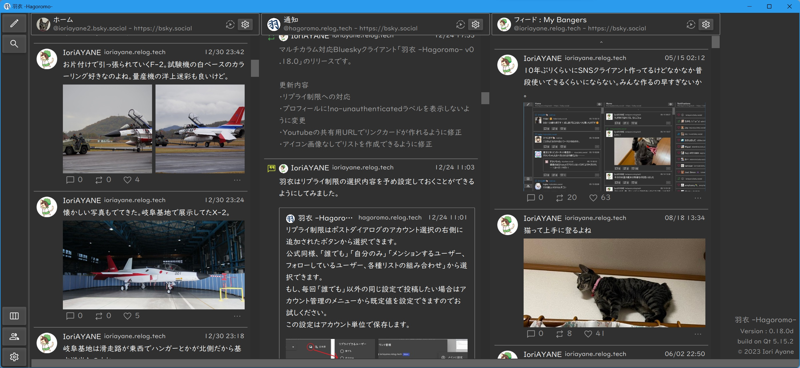

# 羽衣 -Hagoromo-

Welcome to the multi-column, multi-account Bluesky client "Hagoromo" site!

## Features

Hagoromo is a third-party client with the following features.

- Various timelines can be arranged.
- You can create your own real-time feed.
- Multiple accounts can be handled.
- You can choose an account for each column.
- Change the look and feel of the application, including colors and font size.
- It is a desktop application that supports multiple operating systems.
- It is [open source software](https://github.com/ioriayane/Hagoromo) and anyone can freely use it and participate in its development.

## Supported Environments

The following environments have been tested.

- Windows 11
- Ubuntu 22.04
- Mac 15.0.1(x86 on ARM)

## Download


